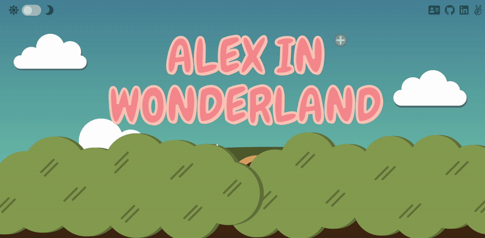

# Alex in Wonderland


[**Visit the Wonderland**](https://alexandria-wong.com/wonderland/)

## Background and Overview 

Alex in Wonderland is an Alice in Wonderland inspired JavaScript and CSS demo single page application. Users may interact with different DOM element and experience CSS transition/animation.

## Functionality and MVPs

In Alex in Wonderland, users are able to:
- View a parallax effect demo
- Interact with different DOM elements and experience CSS transition/animation (eg. scale, translate, transform)
- View the application in dark mode

### Parallax Effect
The parallax effect is done by setting the elements `position: absolute`, and change their position with respecting to the `window.pageYOffset` with different ratio.

```javascript
// src/scripts/parallax.js

document.addEventListener("scroll", (e) => {
  let scroll = window.pageYOffset;
  bush1.style.left = `${-scroll/20}%`;
  bush1.style.width = `${60 + scroll/40}%`;
  rabbithole.style.width = `${120 + scroll/15}%`;
  title.style.top = `${scroll/30}%`;
})
```

### Drag and Drop
The drag and drop demo is based on how Alice ingested potion or cookie to shrink or enlarge respectively. A counter for each item will decrement when the item is used, and the image of the item will change accordingly.

```scss
// src/styles/components/drag-and-drop.scss

.alex img {
  transform: scale(1);
}
```

```javascript
// src/scripts/drag-and-drop.js

shrink.addEventListener("dragstart", ev => {
  ev.dataTransfer.setData("text/plain", "0.5");
})

enlarge.addEventListener("dragstart", ev => {
  ev.dataTransfer.setData("text/plain", "2");
})

alexContainer.addEventListener("dragover", ev => {
  ev.preventDefault();
});

alexContainer.addEventListener("drop", ev => {
  ev.preventDefault();
  let originalMatrix = window.getComputedStyle(alex).getPropertyValue("transform");
  let originalScale = originalMatrix.slice(7).split(",")[0];
  
  let scale = parseFloat(ev.dataTransfer.getData("text/plain"));
  let newScale = originalScale * scale;
  alex.style.transform = `scale(${newScale})`;

if (scale === 0.5) {
  shrinkCount -= 1;
  shrink.removeChild(document.querySelector(".shrink img"));
  shrink.removeChild(document.querySelector(".shrink p"));
  switch (shrinkCount) {
    case 0:
      newShrinkImg.setAttribute("draggable", "false")
      newShrinkImg.setAttribute("src", "src/assets/drag-and-drop/potion-0.svg")
      break;
  }
  shrink.appendChild(newShrinkImg);
  const shrinkEnd = document.createElement("p");
  shrinkEnd.innerHTML = "No more potion :("; 
  shrinkCount === 0 ? shrink.appendChild(shrinkEnd) : shrink.appendChild(newShrinkPrompt);
}
```

### Dark Mode
The dark mode is achieved by toggling a `dark-theme` class in the `body`.

```html
<body class="">
	<header>
		<div class="dark-btn-container">
			<i class="fas fa-sun"></i>
			<button class="switch" id="dark-mode-switch"></button>
			<i class="fas fa-moon"></i>
    </div>
  </header>
</body>
```

```javascript
// src/scripts/darkmode.js

document.addEventListener("DOMContentLoaded", () => {
  const body = document.querySelector("body");
  const toggleSwitch = document.getElementById("dark-mode-switch");
  const currentTheme = localStorage.getItem('theme');

  if (currentTheme == "dark") {
    body.classList.add("dark-theme");
  } else if (currentTheme == "light") {
    body.classList.remove("dark-theme");
  }

  toggleSwitch.addEventListener("click", () => {
    let theme = body.classList.contains("dark-theme") ? "light" : "dark";
    body.classList.toggle('dark-theme');
    localStorage.setItem("theme", theme);
  })
});
```

## Architecture and Technology 
- `HTML5`
- `CSS3/SASS`
- `JavaScript`
- `Typed.js`
- `Webpack`